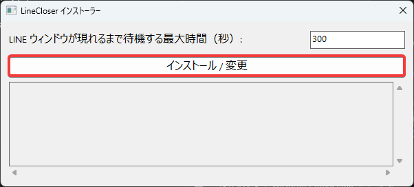

# LineCloser

[](https://github.com/hrko/LineCloser/releases/latest)

Windowsの起動時に自動で表示されてしまうLINEのウィンドウを、自動的に閉じるためのユーティリティツールです。

## インストールと設定

1.  リポジトリの[Releasesページ](https://github.com/hrko/LineCloser/releases/latest)にアクセスします。
2.  最新リリースの`Assets`セクションから`LineCloser.exe`をダウンロードします。
3.  ダウンロードした`LineCloser.exe`を実行します。
4.  インストーラーGUIが表示されるので、「インストール / 変更」ボタンをクリックします。
    

これでインストールとスタートアップへの登録は完了です。設定を変更したい場合は、再度`LineCloser.exe`を実行するか、Windowsのアプリ一覧から「変更」を選択してください。

## アップデート

新しいバージョンがリリースされた場合、同じく[Releasesページ](https://github.com/hrko/LineCloser/releases/latest)から最新の`LineCloser.exe`をダウンロードし、実行してインストール/変更を行うことでアップデートが完了します。

## アンインストール

Windowsの「設定」>「アプリ」>「インストールされているアプリ」（または「アプリと機能」）を開き、一覧から`LineCloser`を選択して「アンインストール」をクリックしてください。

## 上級者向け情報

本アプリケーションは、インストーラー機能を内蔵しており、引数なしで実行するとインストーラーGUIが起動します。引数を指定して実行することで、メインの機能であるLINEウィンドウの自動クローズを実行します。

### 手動インストール

インストーラーを使わず、手動でセットアップすることも可能です。

1.  ダウンロードした`LineCloser.exe`を任意の場所に配置します。
2.  `Windows`キー + `R`キーで「ファイル名を指定して実行」ダイアログを開き、`shell:startup`と入力してスタートアップフォルダを開きます。
3.  配置した`LineCloser.exe`のショートカットを、このスタートアップフォルダ内に作成します。
4.  作成したショートカットを右クリックして「プロパティ」を開き、「リンク先」の末尾に、以下のようにコマンドライン引数を追加します。

**例：タイムアウトを10分 (600秒) に変更する場合**
```
"C:\path\to\LineCloser.exe" --timeout 600
```

| フラグ      | 短縮形 | 説明                                   |
| :---------- | :----- | :------------------------------------- |
| `--timeout` | `-t`   | タイムアウト時間を秒単位で指定します。 |

### インストーラーの動作詳細

インストーラーは以下の処理を実行します。

1.  **ファイルのコピー**: 実行ファイル自身を`%LOCALAPPDATA%\hrko\LineCloser\data\`にコピーします。
2.  **アンインストールスクリプトの生成**: 同ディレクトリにアンインストール用のPowerShellスクリプト（`uninstall.ps1`）を生成します。
3.  **レジストリ登録（アンインストール情報）**: Windowsの「アプリと機能」に表示させるため、`HKEY_CURRENT_USER\Software\Microsoft\Windows\CurrentVersion\Uninstall\LineCloser`に必要な情報を登録します。
4.  **レジストリ登録（スタートアップ）**: Windows起動時に実行されるよう、`HKEY_CURRENT_USER\Software\Microsoft\Windows\CurrentVersion\Run`に、コピーした実行ファイルのパスとタイムアウト引数を登録します。

## ソースからビルド

1.  [Mise](https://mise.jdx.dev/getting-started.html)をインストールします。
2.  このリポジトリをクローンします。
    ```sh
    git clone https://github.com/hrko/LineCloser.git
    cd LineCloser
    ```
3.  必要な依存関係をインストールします。
    ```sh
    mise install
    ```
4.  ビルドを実行します。
    ```sh
    mise run build
    ```
5.  実行ファイルは`target/release/LineCloser.exe`に生成されます。このファイルがインストーラーを兼ねています。

## ライセンス

このプロジェクトは、[MIT License](LICENSE)の下で公開されています。
